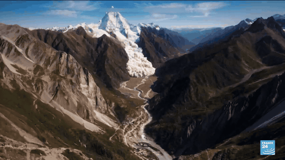
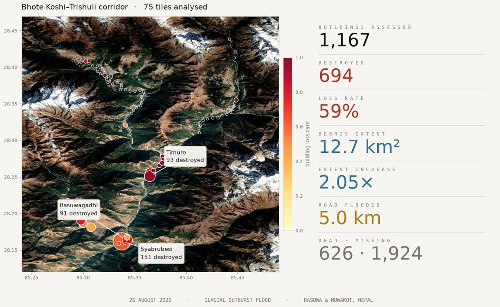
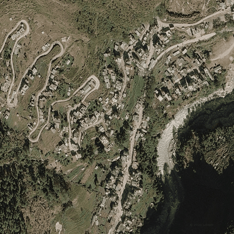
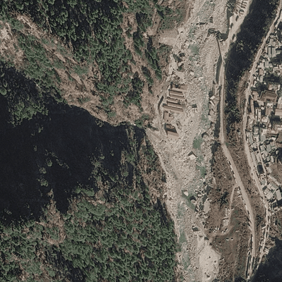
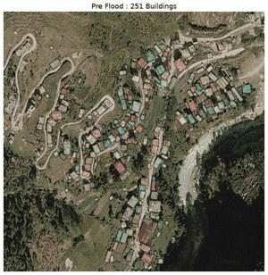
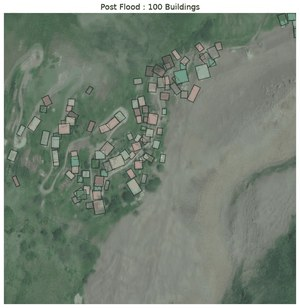
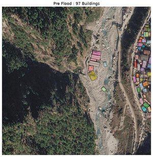
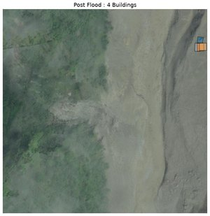

<div align="center">

# Nepal Flood 2026 · Satellite Damage Assessment

`26 AUG 2026`&nbsp;&nbsp;·&nbsp;&nbsp;`GLACIAL OUTBURST FLOOD`&nbsp;&nbsp;·&nbsp;&nbsp;`BHOTE KOSHI–TRISHULI CORRIDOR`



**How it began** — a glacier collapse on the Nepal–China border sends ice and rock 1,200 m into
the Lhende basin, triggering a debris avalanche and outburst flood down 72 km of the Trishuli.
<sub>Reconstruction: FRANCE 24 · <a href="https://www.youtube.com/watch?v=ORPDEvHJZpA">source</a></sub>

[](https://vantor.com/company/open-data-program/)
[](https://creativecommons.org/licenses/by-nc/4.0/)
[](LICENSE)
[]()

**626 dead · 1,924 missing.** This repository reconstructs the damage from open satellite
imagery — flood extent, building loss, severed roads — tile by tile along the river.



</div>

<br>

---

<br>

## Before · After

<div align="center">

<table>
<tr>
<td align="center"><br><b>Syabrubesi</b> · 251 → 100 standing</td>
<td align="center"><br><b>Timure</b> · 97 → 4 standing</td>
</tr>
</table>

<sub>Pre-flood basemap ⇄ 28 Aug 2026 Vantor composite. The pale fan filling each valley floor is
the debris deposit — where a village stood on the channel margin, it is gone.</sub>

</div>

<br>

## Detected buildings

<div align="center">

<table>
<tr>
<th></th>
<th align="center">Before &nbsp;·&nbsp; pre-flood basemap</th>
<th align="center">After &nbsp;·&nbsp; 28 Aug composite</th>
</tr>
<tr>
<td align="right"><b>Syabrubesi</b></td>
<td align="center"></td>
<td align="center"></td>
</tr>
<tr>
<td align="right"><b>Timure</b></td>
<td align="center"></td>
<td align="center"></td>
</tr>
</table>

<sub>YOLOv11-OBB oriented footprints · each colour is one detected structure</sub>

</div>

<br>

---

<br>

## Findings

| | before | after | change |
|:--|--:|--:|:--|
| **Buildings** | 1,167 | 473 | **− 694 · 59 %** |
| **Debris / water extent** | 6.18 km² | 12.68 km² | **2.05 ×** |
| **Road flooded** | — | — | **5.01 km** |
| **Corridor analysed** | — | — | **75 / 187 tiles** |

> [!NOTE]
> **Independent check.** Copernicus EMS [EMSR927](https://mapping.emergency.copernicus.eu/activations/EMSR927/)
> reports *"more than 240 buildings destroyed, 32 damaged"* around Syapru Besi from 27 Aug imagery.
> This analysis returns **214 destroyed** for the same settlement at matched 0.6 m resolution.

#### Worst-affected tiles

| tile | centre | before | after | lost | extent |
|:--|:--|--:|--:|--:|--:|
| `t045` | 28.1617, 85.3375 | 251 | 100 | **151** | 2.86 × |
| `t043` | 28.2510, 85.3647 | 97 | 4 | **93** | 2.68 × |
| `t044` | 28.1644, 85.3413 | 113 | 22 | **91** | 1.86 × |
| `t046` | 28.1638, 85.3428 | 87 | 19 | **68** | 2.11 × |
| `t042` | 28.2556, 85.3653 | 79 | 15 | **64** | 2.30 × |
| `t059` | 28.1904, 85.2979 | 66 | 14 | **52** | 1.07 × |

---

<br>

## Method

```
   Google basemap ──── pre-flood RGB · 0.3 / 0.6 m ────┐
                                                        ├──▶ YOLOv11-OBB ──▶ footprints, pre vs post
   Vantor Open Data ── post-flood RGB · cloud composite ┤
   9 scenes · 27–28 Aug                                 └──▶ DINOv3 vit-l-sat ──▶ debris extent
                                                              seeded from OSM river channel
```

**Cloud is the binding constraint.** Every post-event scene is 71–81 % cloud — but the nine scenes
cloud *differently*. A per-pixel bright-and-achromatic test masks each one, then a median composite
recovers near-complete ground: **100 % clear** over Syabrubesi from scenes individually
three-quarters obscured.

**Extent without labels.** DINOv3 patch embeddings, prototype drawn from the OSM river channel,
thresholded on cosine similarity. No training, no annotation.

**Buildings, honestly.** A structure counts as *lost* only when a pre-flood footprint has no
post-flood detection within 10 m — anchored to what existed before.

---

<br>

## Quick start

```bash
pip install -r requirements.txt
jupyter lab notebooks/analysis.ipynb    # one tile, interactive
python -m nepalflood.batch              # full corridor, resumable
python -m nepalflood.report             # HTML report
```

Weights → [`building-miner-stable.pt`](https://huggingface.co/datasets/gajeshladhar/artifacts) into `weights/`

```
src/nepalflood/  batch · detect_highres · render · report · report_compare
configs/         187 tile centres · 522 m spacing along the river
notebooks/       analysis.ipynb — reference implementation
results.json     per-tile metrics
```

<br>

## Data

| source | role | licence |
|:--|:--|:--|
| [Vantor Open Data](https://vantor-opendata.s3.amazonaws.com/events/Nepal-Flooding-Aug-2026/collection.json) | post-event RGB · 35–58 cm · 9 scenes | CC-BY-NC-4.0 |
| Google basemap | pre-event reference | — |
| [OpenStreetMap](https://www.openstreetmap.org/copyright) | river · highways · bridges | ODbL |
| ESRI LULC 2024 | water fallback seed | — |
| Sentinel-1 RTC | verified · orbit 85 · 16 → 28 Aug | open |
| FRANCE 24 | origin reconstruction (header) | © FRANCE 24 |

---

<br>

## Limitations

> [!IMPORTANT]
> **These are remote-sensing estimates, not verified ground counts.**

- **Two days after.** An outburst surge, not a standing flood. By 28 Aug the water had largely
  drained; what remains is the **debris deposit**. Extent describes the affected corridor, not
  peak inundation.
- **Detector granularity.** YOLO merges adjacent structures into single oriented boxes. Against
  Google Open Buildings over Timure it finds 4.6 × fewer objects but ~90 % of the same built *area*.
- **Resolution sensitivity.** Counts are not stable across image sharpness — pre and post must be
  compared at matched resolution.
- **Tile overlap.** 522 m spacing with 614 m footprints guarantees gap-free coverage but
  double-counts ~14 % of buildings; deduplicate spatially before quoting a corridor total.
- **Partial coverage.** 75 of 187 tiles. Upper Rasuwa is well covered; Nuwakot and Bidur are not.

<div align="center">
<sub>Imagery © Vantor · CC-BY-NC-4.0 &nbsp;·&nbsp; Map data © OpenStreetMap contributors &nbsp;·&nbsp; Origin footage © FRANCE 24<br>
<b>Built for humanitarian response · not for commercial use</b></sub>
</div>
